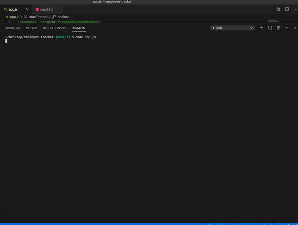

# Employee Tracker

A CLI content management system for managing a company's employees using node, inquirer, and MySQL.

## User Story

```
As a business owner
I want to be able to view and manage the departments, roles, and employees in my company
So that I can organize and plan my business
```

This application allows the user to:

  * Add departments, roles, employees

  * View departments, roles, employees

  * Update employee roles

  * Delete an employee

## How to Use


First clone the repository:

git clone https://github.com/fares3356/sql-employee-tracker.git

You need to maysure that you have Node.js installed. after, three packages are needed: mysql2, console.table, and inquirer. These can be installed by running npm i inside of the cloned repository. (npm i mysql2 console.table inquirer)

It is also necessary to have MySQL installed on your computer. Installation instructions can be found here

Once MySQL is installed, connect to the mysql server by running (assuming correct install) :

mysql -u root -p.


Open your terminal and change into the corresponding directory. Run "node app.js" and you will be prompted with options.


## Database

The database contains three tables:


* **department**:

  * **id** - INT PRIMARY KEY
  * **name** - VARCHAR(30) to hold department name

* **role**:

  * **id** - INT PRIMARY KEY
  * **title** -  VARCHAR(30) to hold role title
  * **salary** -  DECIMAL to hold role salary
  * **department_id** -  INT to hold reference to department role belongs to

* **employee**:

  * **id** - INT PRIMARY KEY
  * **first_name** - VARCHAR(30) to hold employee first name
  * **last_name** - VARCHAR(30) to hold employee last name
  * **role_id** - INT to hold reference to role employee has
  * **manager_id** - INT to hold reference to another employee that manager of the current employee


## Demo



